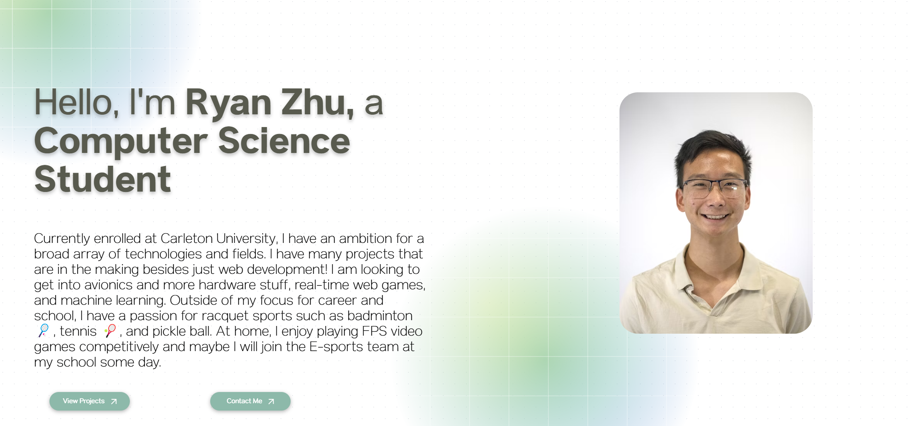

# Hi there! 👋

My name is Ryan Zhu! Here, you'll find a mix of projects ranging from web development and AI, to hardware projects like mechanical aimbots and flying helicopters.

  <table>
    <tr>
      <td>
        
      </td>
      <td align="center" vertical-align="middle">
          
      </td>
    </tr>
  </table>

      

# 🌟 Current Favourite Projects

  <table>
    <tr>
      <td>
        
      </td>
      <td align="center" vertical-align="middle">
        
      </td>
    </tr>
  </table>

# 🌍 Portfolio

---

**Thanks for stopping by! Feel free to explore my repositories and contribute. 😊**
